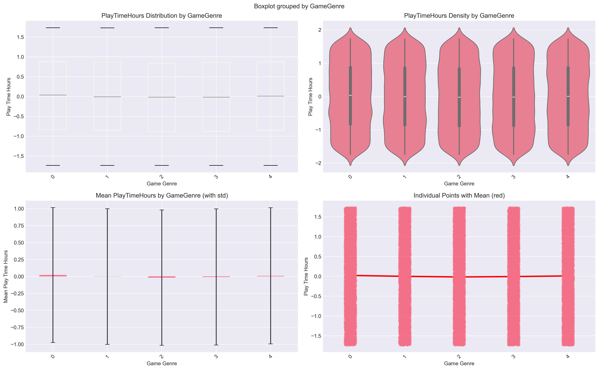
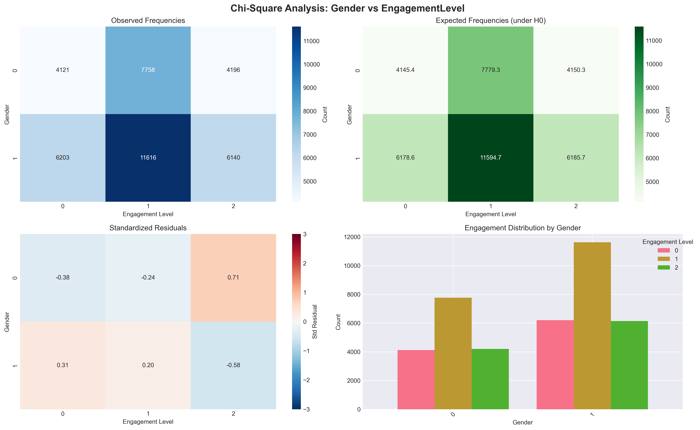

# Comprehensive Summary

## Statistical Tests

| Test         | Variables                    | Test Statistic       | P-value    | Significant? | Effect Size                 |
|-------------|------------------------------|-------------------|-----------|-------------|----------------------------|
| ANOVA       | PlayTimeHours vs GameGenre   | F = 1.7745         | 0.1308    | No          | η² = 0.0002 (Negligible)  |
| Chi-Square  | Gender vs EngagementLevel    | χ² = 1.1808        | 0.5541    | No          | V = 0.0054 (Negligible)   |

---

## Key Findings

1. **ANOVA Test (PlayTimeHours vs GameGenre)**  
   - ✗ No significant difference (p ≥ 0.05)  
   - ✗ Game genre does not significantly affect play time  

2. **Chi-Square Test (Gender vs EngagementLevel)**  
   - ✗ No significant association (p ≥ 0.05)  
   - ✗ Gender and engagement level are independent

## Graphical Analysis

### ANOVA Analysis

### Chi-Square Analysis
