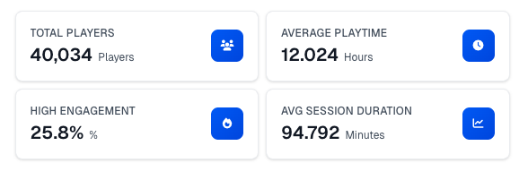
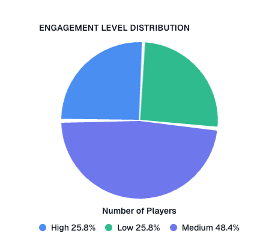
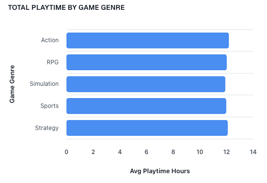
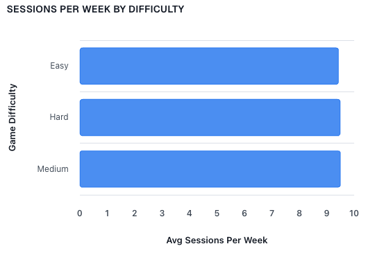
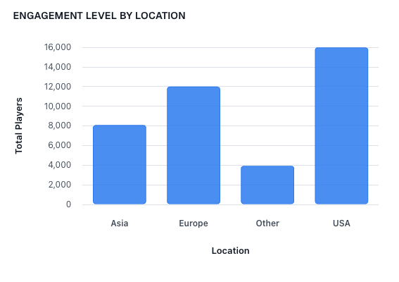
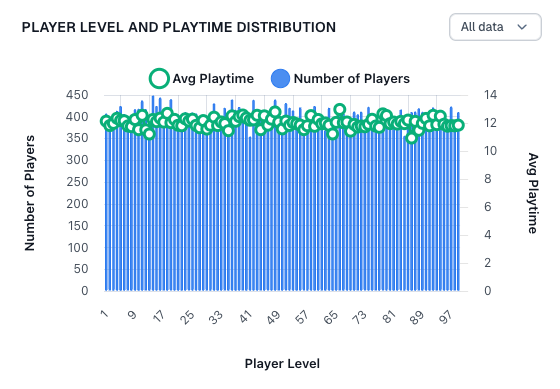
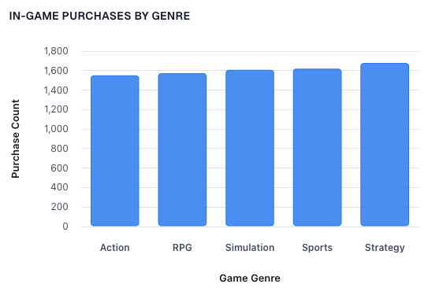
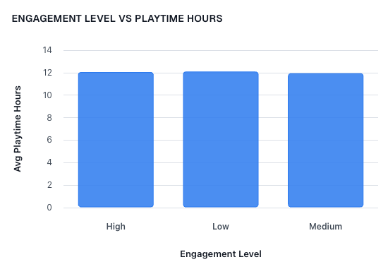
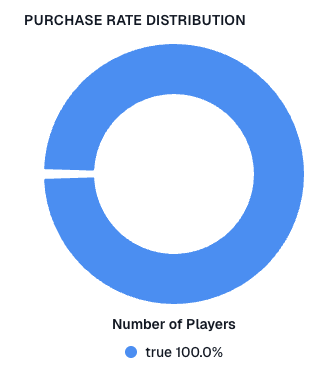
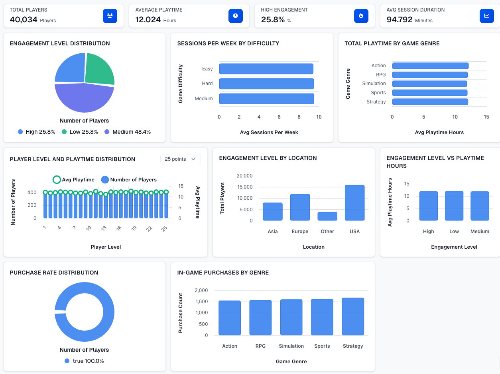

# Online Gaming Behavior Analytics Dashboard

Comprehensive analysis of player demographics, gaming behavior patterns, engagement levels, and gameplay metrics across different game genres and platforms.

## Key Performance Indicators

With 40,034 total players, the platform has established a robust user base suitable for monetization strategies. The average playtime of 12.02 hours demonstrates strong engagement; however, the high-engagement share of 25.8% trails the industry benchmark of ~30% for premium games, revealing an opportunity to convert mid-tier players. Session duration averaging 95 minutes aligns with sector standards for immersive experiences, supporting sustained ad revenue. These metrics reflect a healthy foundation with clear potential to expand the high-engagement segment and boost revenue.

## Engagement Distribution Insights

The engagement breakdown shows medium-engaged players represent 48% of the community, substantially outnumbering both high and low segments at ~26% each. This distribution identifies a critical conversion opportunity—a large cohort primed for advancement to high engagement through targeted content or rewards. The near-equivalent split between high and low engagement also signals churn risk among less-engaged users, addressable through re-engagement initiatives. Strategic resource allocation to elevate the mid-tier while stabilizing the low-tier could reshape engagement favorably.

## Genre Playtime Analysis

Playtime consistency across genres ranges from 11.90 to 12.16 hours, with Action marginally leading at 12.16 hours. This narrow variance suggests genre choice minimally impacts time investment, enabling cross-genre marketing effectiveness. Action's modest advantage may reflect superior core mechanics, indicating design patterns worth adopting across other titles. The data underscores uniform audience engagement, reducing reliance on genre-specific retention strategies.

## Difficulty Level Session Frequency

Weekly sessions remain stable across difficulty tiers—Medium (9.51), Hard (9.50), and Easy (9.44)—indicating difficulty presents no meaningful barrier to play frequency. This consistency likely reflects either adaptive progression or effective matchmaking. Medium difficulty's slight edge suggests an optimal engagement threshold. Content freshness should take priority over difficulty recalibration for session growth.

## Geographic Player Distribution

The USA accounts for 16,000 players (40%), trailed by Europe (12,004), Asia (8,095), and other regions (3,935). While US dominance warrants continued marketing focus, Asia's proportionally smaller footprint represents significant expansion potential. Localized campaigns and regional events could balance distribution and revenue diversification. Over-concentration in a single market underscores the need for geographic diversification.

## Player Progression Metrics

Average playtime across player levels remains relatively stable at 11.5–12.8 hours, with a notable dip at level 86 (10.93 hours) and peak at level 48 (12.79 hours). Player counts per level hold steady between 350–450, indicating balanced progression without significant attrition. The marginal playtime increase at higher levels suggests veteran players invest additional time, possibly through advanced content. The level 86 anomaly warrants investigation for potential friction points.

## In-Game Purchase Performance by Genre

Purchase volumes climb from Action (1,553) to Strategy (1,680), with Strategy outperforming by approximately 8%. This trend suggests strategic titles drive stronger monetization through compelling progression mechanics. While overall purchase volume remains modest relative to player count, genre-specific insights direct content investment priorities. Enhancing purchase pathways in high-converting genres and aligning promotions with strategic audiences could amplify returns.

## Playtime by Engagement Level

Counterintuitively, low-engagement players log the highest playtime (12.10 hours), slightly ahead of high-engagement players (12.07 hours), while mid-engagement ranks lowest (11.96 hours). This pattern suggests engagement may prioritize frequency over duration, or low-engagement users demonstrate longer individual sessions. This discrepancy warrants engagement metric refinement or targeted investigation. Extending mid-tier session length could amplify overall playtime gains.

## Monetization Conversion Gap

Only 20% of players (8,041) have completed in-game purchases, leaving 80% as untapped revenue potential. This conversion rate identifies a substantial monetization opportunity. Tactics including tiered rewards, limited-time offers, and personalized incentives could mobilize the non-purchasing majority. Given the large player base, even incremental conversion improvements yield significant revenue impact.

## Complete Dashboard Overview

