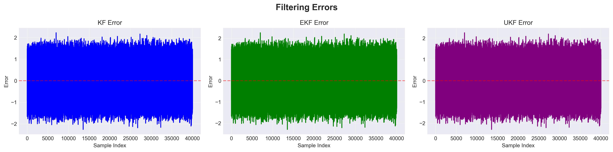

## Kalman Filters Results

### Performance Comparison

| Filter  |   RMSE | Description                  | Ranking      |
|---------|-------:|------------------------------|-------------|
| **KF**  | 0.8978 | Standard linear filter       | 3rd place   |
| **EKF** | 0.8941 | Handles some nonlinearity    | 2nd place   |
| **UKF** | 0.8940 | Best at nonlinear patterns  |   Winner   |

**Winner:** **UKF** — lowest RMSE, most accurate filter

### Comparison Graph
- Kalman Filters Comparison

- Kalman Filters Errors

